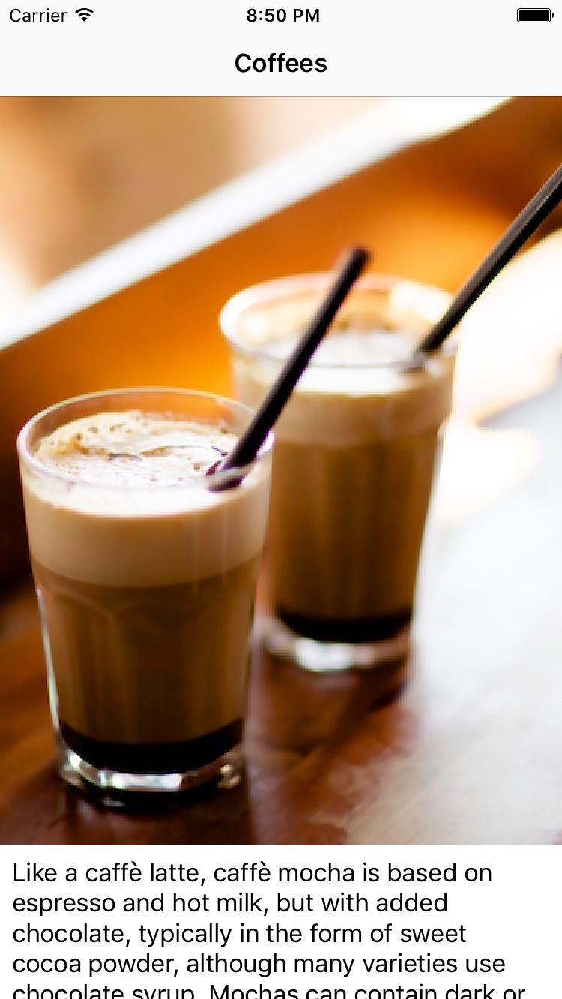
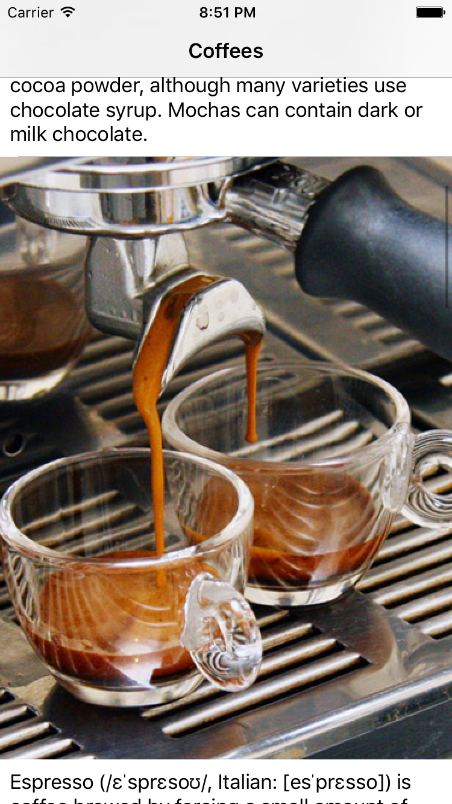
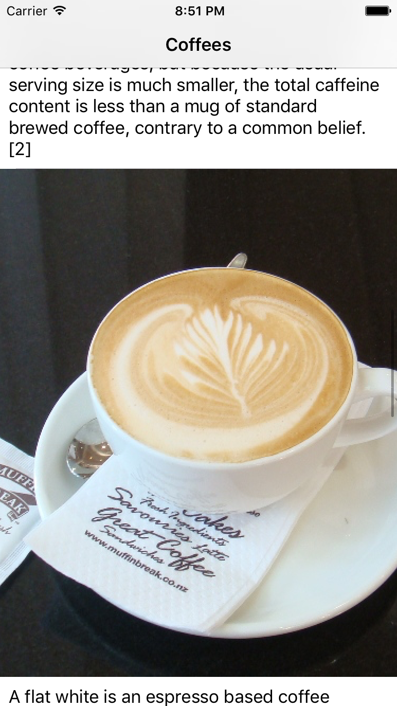

# Overview
This is a simple coffee apps that explains the different kind of coffees. The app will have a coffee image and its descriptions in each `UITableViewCell`. The images will be in different sizes and the number of characters in descriptions will different as well.

The aim is to demonstrate how to easily create a dynamic `UITableViewCell` height base on `constraint` set in `Storyboard` that consist a `UIImageView` and `UILabel`. These details could possibly be updated from an api call like most app out there.

## Blog Post
A detailed blog post on this topic can be view [here](https://bot-zeta.herokuapp.com/post/1/).

## Version Info

- `swift3.0`
- `Xcode8`

## Screenshot

